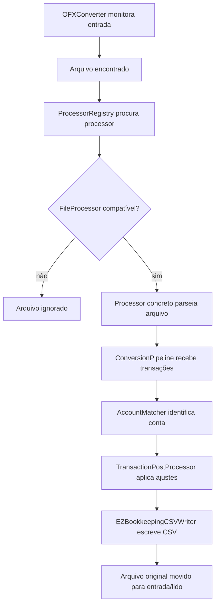
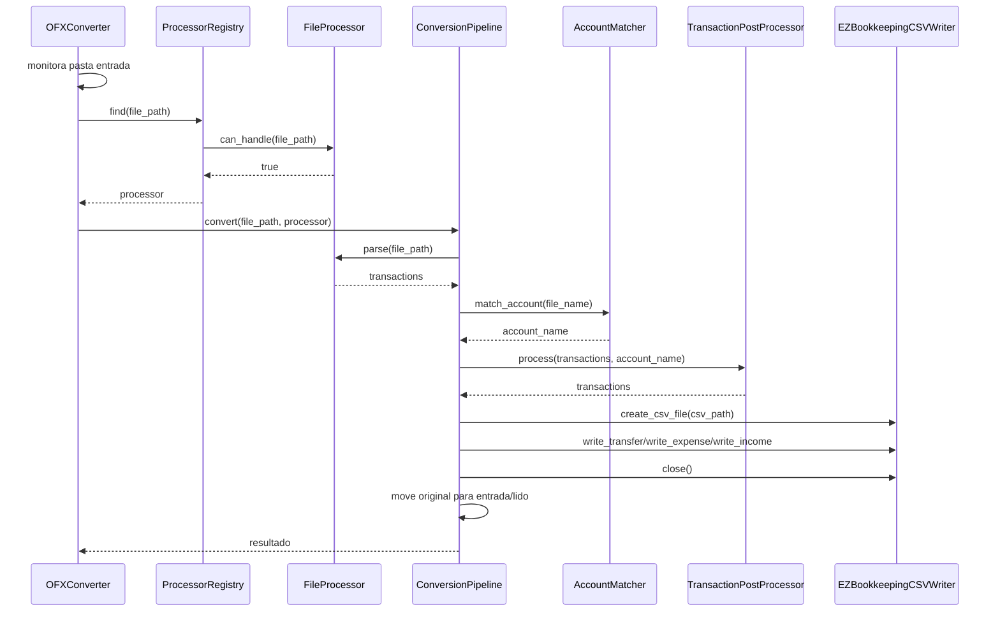
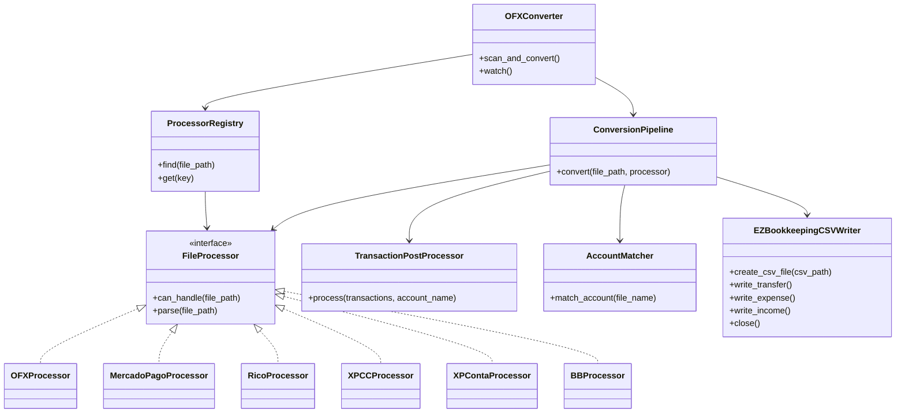

# Arquitetura do conversor OFX

## Fluxo de conversão

## Sequência de chamadas

## Relação entre componentes

## Observação

Parsers internos existem, mas ficaram fora dos diagramas porque não estavam na lista de componentes solicitada.
