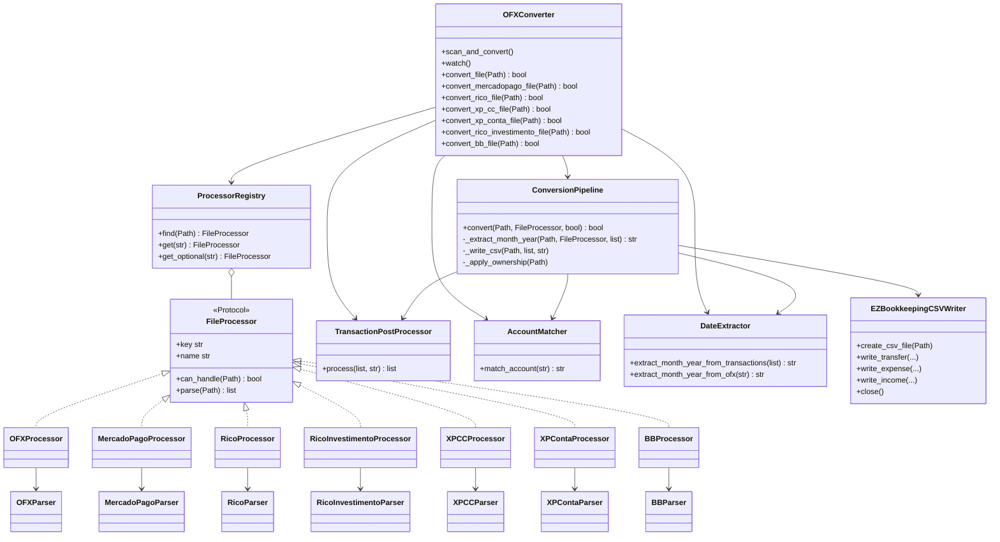
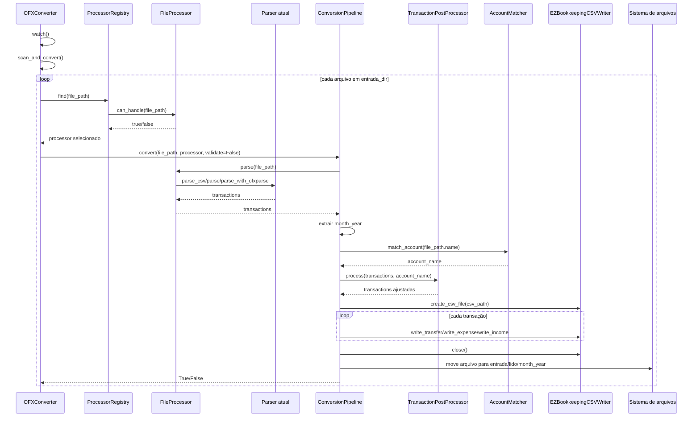
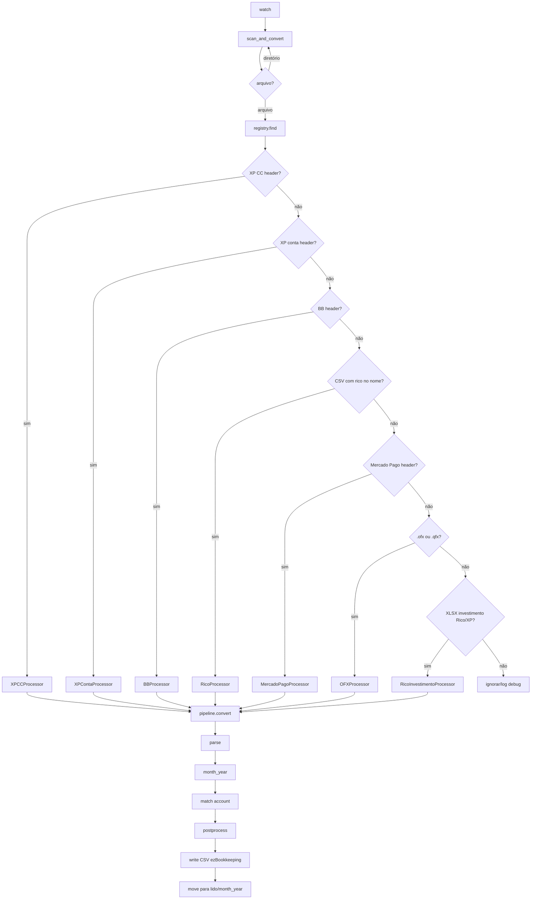

# UML arquitetura final

## Resumo

O projeto agora separa o fluxo comum de conversão da lógica específica de cada banco/formato.

`OFXConverter` inicializa dependências, monta processors, cria registry e executa o loop de monitoramento. `ProcessorRegistry` escolhe qual processor entende cada arquivo. `ConversionPipeline` executa o fluxo comum: parse, mês, conta, pós-processamento, escrita CSV e movimentação para `lido`.

## Responsabilidades

- `OFXConverter`: entrypoint, paths, dependências, loop `watch`, wrappers `convert_*`.
- `ProcessorRegistry`: resolve processor por prioridade de detecção.
- `FileProcessor`: contrato simples para `can_handle` e `parse`.
- Processors concretos: adaptam parsers atuais sem mudar regra interna.
- Parsers atuais: continuam lendo exports dos bancos/corretoras.
- `ConversionPipeline`: fluxo comum compartilhado por todos formatos.
- `TransactionPostProcessor`: ajustes após parse, hoje regra Nubank "Pagamento recebido".
- `AccountMatcher`: identifica conta ezBookkeeping pelo nome do arquivo.
- `DateExtractor`: extrai mês/ano para organizar saída.
- `EZBookkeepingCSVWriter`: escreve CSV final compatível com ezBookkeeping.

## Diagrama de classes

## Diagrama de sequência

## Diagrama de fluxo

## Métodos chamados em ordem

1. `OFXConverter.watch()`
2. `OFXConverter.scan_and_convert()`
3. `ProcessorRegistry.find(file_path)`
4. `processor.can_handle(file_path)`
5. `ConversionPipeline.convert(file_path, processor, validate=False)`
6. `processor.parse(file_path)`
7. Parser específico:
   - `OFXParser.parse_with_ofxparse()` e fallback `parse_with_regex()`
   - `MercadoPagoParser.parse_csv()`
   - `RicoParser.parse()`
   - `RicoInvestimentoParser.parse()`
   - `XPCCParser.parse_csv()`
   - `XPContaParser.parse_csv()`
   - `BBParser.parse()`
8. `DateExtractor.extract_month_year_from_transactions()` ou `extract_month_year_from_ofx()`
9. `AccountMatcher.match_account()`
10. `TransactionPostProcessor.process()`
11. `EZBookkeepingCSVWriter.create_csv_file()`
12. `EZBookkeepingCSVWriter.write_transfer/write_expense/write_income()`
13. `EZBookkeepingCSVWriter.close()`
14. `shutil.move()` para `entrada/lido/<month_year>/`
15. callback de ownership opcional.

## Como adicionar novo banco/formato

1. Criar ou adaptar parser em `services/`.
2. Criar processor em `services/processors/novo_banco_processor.py`.
3. Implementar `key`, `name`, `can_handle(file_path)` e `parse(file_path)`.
4. Exportar processor em `services/processors/__init__.py`.
5. Registrar processor em `OFXConverter._build_processors()` na ordem correta.
6. Adicionar teste/golden file quando existir massa segura.

O novo processor não deve escrever CSV, mover arquivo ou resolver conta. Essas etapas ficam no `ConversionPipeline`.
